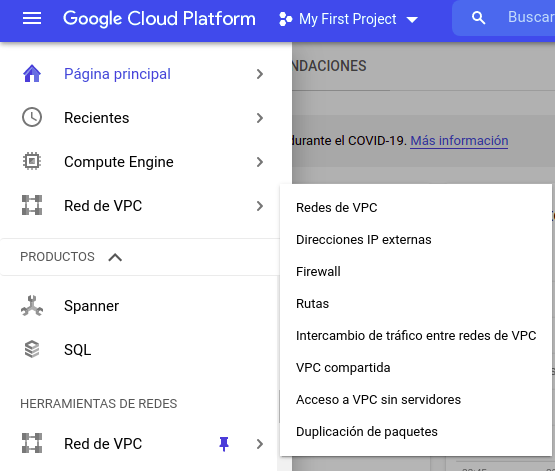
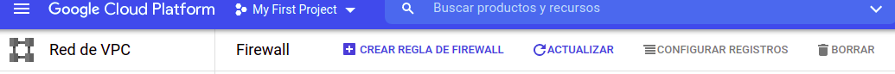
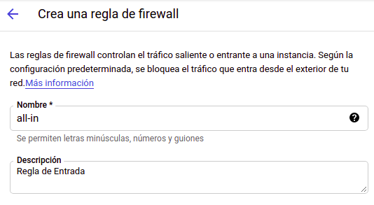
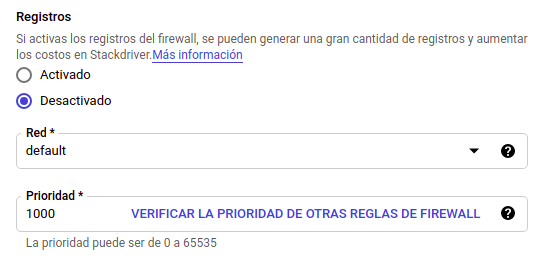
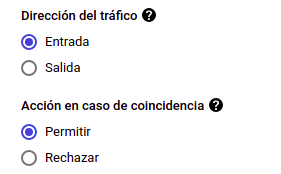
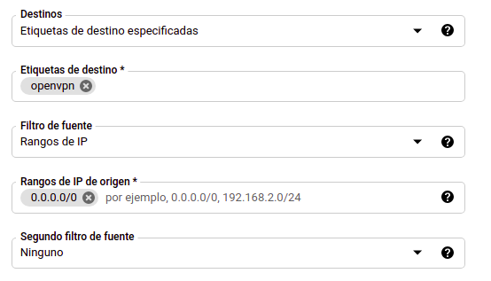

# 
  MANUAL VPN EN GCP 

## INSTRUCCIONES
<ol> 
    <li><a href="#info">ANTES DE EMPEZA
        <ol>
            <a href="#info1"><li>SOFWARE NECESARIO</li></a>
            <a href="#info2"><li>GOOGLE CLUD PLATFORM </li></a>
        </ol>
    <li><a href="#firewall"> REGLAS DE FIREWALL </a> 
        <ol>
            <a href="#firewall1"><li>CARGAR NUEVA REGLA DE FIRE WALL</li></a>
            <a href="#firewall2"><li>REGLAS DE ENTRADA </li></a>
            <a href="#firewall3"><li>REGLAS DE SALIDA </li></a>
        </ol>
    </li>
    <li><a href="#mv"> MÁQUINA VIRTUAL (GCP)</a> 
        <ol>
            <a href="#firewall"><li>REGLAS DE ENTRADA </li></a>
            <a href="#firewall"><li>REGLAS DE SALIDA </li></a>
        </ol>
    </li>
    <li><a href="#vpn"> CONFIGURACIÓN VPN </a> 
        <ol>
            <a href="#firewall"><li>REGLAS DE ENTRADA </li></a>
            <a href="#firewall"><li>REGLAS DE SALIDA </li></a>
        </ol>
    </li>
</ol>

## 
 1. ANTES DE EMPEZA 

### 
 1.1 SOFTWARE NECESARIO 

Para poder realizar la conexion de los host físicos es ncesario de un cliente VPN, para fines de esta práctica se utilizó el software OpenVPN Connect
El cuál puede se obtenido de su página  

> https://openvpn.net/download-open-vpn/

OpenVPN Connect es conpatible con:
- Windws
- Linux
- macOS
- Android
- Iphon

### 
 1.2 GOOGLE CLUD PLATFORM 

Es necesario de una cuenta activa en Google para poder registrarse en Google Cloud Platform. Google Cloud Platformm ofrece una capa gratuita, tras haber registrado una targeta de débito o crédito, la cual ofrece $300 como crédito y 3 meses de tiempo límite para ocupar la capa gratuita.  
El servidor VPN se levantó sobre la capa gratuita que proporciona Google Cloud Platform.  

> https://cloud.google.com/

## 
 2. REGLAS DE FIREWALL 

Buscaremos al apartado de 'Red de VPC' -> 'Firewall' para agregar las nuevas reglas.

Selecionaremos la opción de 'CARGAR REGLA DE FIREWAL'.  
Usaremos esta opción para cargar las reglas de entrada y salida.  

### 
 2.1 REGLAS DE ENTRADA

Ingresaremos un nuevo nombre para nuestra nueva regla (para fines de esta práctica se escogio el nombre de 'all-in' pero esta puede ser cambiada a conbeniencia del creador de la nueva regla). Además podemos agregar una descripción de nuestra nueva regla, este campo es opcional.  

A fines de esta práctica dejaremos de las opciones de 'Registros', 'Red' y 'Prioridad' con los valores que vienen por defecto.  

Ahora seleccionaremos como 'Dirección de tráfico'->'Entrada' y 'Acción en caso de coincidencia'->'Permitir'  

En la opción 'Destinos'->'Etiquetas de destino especificadas' con el fin de aplicar estas reglas a la red de las Máquinas Virtuales únicamente que tengan en sus etiquetas de red el la etiquta definida en 'Etiquetas de destino' (para fines de esta práctica se eligio el nombre de 'openvpn'), es importante que tanto las reglas de entrada y salida tengan la misma etiqueta para que ambas reglas sean aplicadas en la red de la Máquina Virtual.  

### 
 2.2 REGLAS DE SALIDA  

Ingresaremos un nuevo nombre para nuestra nueva regla (para fines de esta práctica se escogio el nombre de 'all-out' pero esta puede ser cambiada a conbeniencia del creador de la nueva regla). Además podemos agregar una descripción de nuestra nueva regla, este campo es opcional.  

A fines de esta práctica dejaremos de las opciones de 'Registros', 'Red' y 'Prioridad' con los valores que vienen por defecto.  

Ahora seleccionaremos como 'Dirección de tráfico'->'Salida' y 'Acción en caso de coincidencia'->'Permitir'  

## 
 3. MÁQUINA VIRTUAL (GCP)  

## 
 4. INSTALACIÓN DE VPN 

