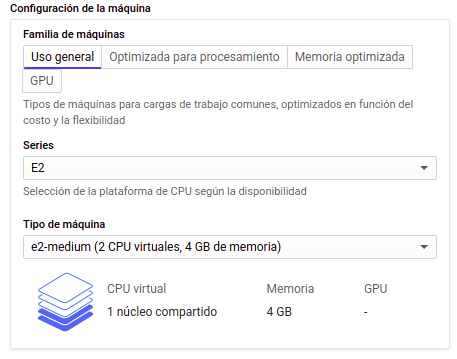
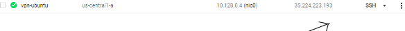
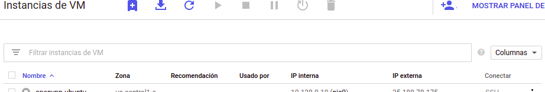

# 
  MANUAL VPN EN GCP 

## INSTRUCCIONES
<ol> 
    <li><a href="#info">ANTES DE EMPEZA
        <ol>
            <a href="#info1"><li>SOFWARE NECESARIO</li></a>
            <a href="#info2"><li>GOOGLE CLUD PLATFORM </li></a>
        </ol>
    <li><a href="#firewall"> REGLAS DE FIREWALL </a> 
        <ol>
            <a href="#firewall1"><li>CARGAR NUEVA REGLA DE FIRE WALL</li></a>
            <a href="#firewall2"><li>REGLAS DE ENTRADA </li></a>
            <a href="#firewall3"><li>REGLAS DE SALIDA </li></a>
        </ol>
    </li>
    <li><a href="#vm"> MÁQUINA VIRTUAL (GCP)</a> 
        <ol>
            <a href="#vm1"><li>CREAR UNA NUEVA INSTANCIA </li></a>
        </ol>
    </li>
    <li><a href="#vpn"> INSTALACIÓN DE VPN </a> 
        <ol>
            <a href="#vpn1"><li>CONEXIÓN CON LA MÁQUINA VIRTUAL</li></a>
            <a href="#vpn2"><li>CREAR EL SERVIDOR VPN</li></a>
            <a href="#vpn3"><li>DESCARGAR ARCHIVO .OVPN</li></a>
            <a href="#vpn4"><li>AGREGAR UN NUEVO CLIENTE </li></a><a href="#vpn5"><li>CONECTAR UN CLIENTE CON LA VPN </li></a>
        </ol>
    </li>
</ol>

## 
 1. ANTES DE EMPEZA 

### 
 1.1 SOFTWARE NECESARIO 

Para poder realizar la conexion de los host físicos es ncesario de un cliente VPN, para fines de esta práctica se utilizó el software OpenVPN Connect
El cuál puede se obtenido de su página  

> https://openvpn.net/download-open-vpn/

OpenVPN Connect es conpatible con:
- Windws
- Linux
- macOS
- Android
- Iphone

### 
 1.2 GOOGLE CLUD PLATFORM 

Es necesario de una cuenta activa en Google para poder registrarse en Google Cloud Platform. Google Cloud Platformm ofrece una capa gratuita, tras haber registrado una targeta de débito o crédito, la cual ofrece $300 como crédito y 3 meses de tiempo límite para ocupar la capa gratuita.  
El servidor VPN se levantó sobre la capa gratuita que proporciona Google Cloud Platform.  

> https://cloud.google.com/

## 
 2. REGLAS DE FIREWALL 

Buscaremos al apartado de 'Red de VPC' -> 'Firewall' para agregar las nuevas reglas.

### 
 2.1 CARGAR NUEVA REGLA

Selecionaremos la opción de 'CARGAR REGLA DE FIREWAL'.  
Usaremos esta opción para cargar las reglas de entrada y salida.  

### 
 2.2 REGLAS DE ENTRADA

Ingresaremos un nuevo nombre para nuestra nueva regla (para fines de esta práctica se escogio el nombre de 'all-in' pero esta puede ser cambiada a conbeniencia del creador de la nueva regla). Además podemos agregar una descripción de nuestra nueva regla, este campo es opcional.  

A fines de esta práctica dejaremos de las opciones de 'Registros', 'Red' y 'Prioridad' con los valores que vienen por defecto.  

Ahora seleccionaremos como 'Dirección de tráfico'->'Entrada' y 'Acción en caso de coincidencia'->'Permitir'  

En la opción 'Destinos'->'Etiquetas de destino especificadas' con el fin de aplicar estas reglas a la red de las Máquinas Virtuales únicamente que tengan en sus etiquetas de red el la etiquta definida en 'Etiquetas de destino' (para fines de esta práctica se eligio el nombre de 'openvpn'), es importante que tanto las reglas de entrada y salida tengan la misma etiqueta para que ambas reglas sean aplicadas en la red de la Máquina Virtual.  
En 'Filtro Fuente'->'Rangos de IP' esto para poder limitar el rango clientes IP que queremos restringir para poder acceder a nuestra red VPN, este rango se definirá en 'Rangos de IP de origen' (a fines de esta práctica se permitió el acceso a todas las direcciones IP).  

Por ultimo se estbleció en 'Protocols and ports'->'udp: 1194'.  

Se dió click en el botón 'Crear' para crear nuestra nueva regla de entrada.  

### 
 2.3 REGLAS DE SALIDA  

Ingresaremos un nuevo nombre para nuestra nueva regla (para fines de esta práctica se escogio el nombre de 'all-out' pero esta puede ser cambiada a conbeniencia del creador de la nueva regla). Además podemos agregar una descripción de nuestra nueva regla, este campo es opcional.  

A fines de esta práctica dejaremos de las opciones de 'Registros', 'Red' y 'Prioridad' con los valores que vienen por defecto.  

Ahora seleccionaremos como 'Dirección de tráfico'->'Salida' y 'Acción en caso de coincidencia'->'Permitir'  

En la opción 'Destinos'->'Etiquetas de destino especificadas' con el fin de aplicar estas reglas a la red de las Máquinas Virtuales únicamente que tengan en sus etiquetas de red el la etiquta definida en 'Etiquetas de destino' (para fines de esta práctica se eligio el nombre de 'openvpn'), es importante que tanto las reglas de entrada y salida tengan la misma etiqueta para que ambas reglas sean aplicadas en la red de la Máquina Virtual.  
En 'Filtro Fuente'->'Rangos de IP' esto para poder limitar el rango clientes IP que queremos restringir para poder acceder a nuestra red VPN, este rango se definirá en 'Rangos de IP de origen' (a fines de esta práctica se permitió el acceso a todas las direcciones IP).  

Por ultimo se estbleció en 'Protocols and ports'->'udp: 1194'.  

Se dió click en el botón 'Crear' para crear nuestra nueva regla de entrada. 

## 
 3. MÁQUINA VIRTUAL (GCP)  

Selccionar 'Compute Engine'->'Instancias Vm' crear una nueva instancia de una Máquina Virtual.  

### 
 3.1 CREAR UNA NUEVA INSTANCIA 

Seleccionaremos la opción 'Crear instancia' para crear una nueva Instancia de una Máquina Virtual.

Ingresaremos el nombre de nuestra nueva Instancia (en esta practica a modo de ejmplo se colocó de nombre 'vpn-ubuntu').  
Tambien se puende configurar Etiquetas y configurar la Región y la Zona.  

También se puede configurar la máquina en 'Configuración de la máquina', se puede configurar la CPU y la memoria (a fines de esta práctica basta con los valores por defecto para poder ejecutar el servidor de la VPN).  

El Sistema Operativo se estableció con Ubuntu 18.04 LTS.  

Seleccionaremos el apartado de 'Administración, seguridad, discos, roles, redes, usuario único' para aplicar nuestras reglas del firewal.  

Aplicaremos nuestras reglas en la pestaña 'Herramientas de red'->'Etiquetas de red' en la cual colocaremos la etiqueta que establecimos para nuestras reglas de entrada y salida.

Por ultimo daremos click en la opción 'Crear' para crear nuestra nueva Instancia.

## 
 4. INSTALACIÓN DE VPN 

### 
 4.1 CONEXIÓN CON LA MÁQUINA VIRTUAL 

Google Cloud Plataform nos ofrece la opción de conectarnos a la consola de la Máquina Virtual mediante ssh. Esta opcción la podemos entcontrar en 'Instancias de VM'.

### 
 4.2 CREAR EL SERVIDOR VPN 

Por medio de la conexión a la Máquina Virtual podemos acceder a la concosla de Ubuntu.  
Empezaremos actualizando las librerias de Ubuntu con el comando.  

~~~
sudo apt-get update 
~~~

Ejecutaremos las actualizaciones con:  

~~~
sudo apt-get upgrade
~~~

Ejecutaremos el script de la instalcción del servidor VPN en la siguiente dirección y ejecutaremos el programa.  

~~~
sudo wget https://cubaelectronica.com/OpenVPN/openvpn-install.sh && sudo bash openvpn-install.sh
~~~
Presionaremos enter para comenzar con la ejecución del programa.  

Se mostrará la dirección IP privada (IP interna) y presionamos enter.  
Ingresamos la dirección IP pública (IP externa) y presionamos Enter.  

Estas pueden verse en 'Instancias de VM'.  
Selecionaremos el protocolo UDP colocando 1 y daremos Enter.  

Estableceremo el puerto 1194 y daremos enter.  

Seleccionaremos como DNS a Google colocando 3 y daremos enter.  

Finalemente nos pedirá Ingresar el nombre de nuestro primer cliente.  

Nos mostrará la ubicación de donde se ha generado la llave para que nuestro cliente se pueda conectar con la VPN.  

### 
 4.3 DESCARGAR ARCHIVO .OVPN 

Descargamos el archivo que nos generó dando click en la tuerca y seleccionamos la opción de “Descargar Archivo”.  

Nos abre una ventana en la cual ingresamos, sin colocar espacios, la ubicación en donde se ha generado el archivo.  

  

  

### 
 4.4 AGREGAR UN NUEVO CLIENTE  

Ingresar nuevamente el comando en la consola.  

~~~
sudo bash openvpn-install.sh
~~~

Seleccionar la opción (1).  

 

Ingresar el nombre del nuevo cliente.  

 

Descargar nuevamente el archivo .ovpn generado.  

### 
 4.5 CONECTAR UN CLIENTE CON LA VPN 

Abriremos es sofrware OpenVPN Connect instalado en nuestro cliente.  

Iremos al apartado File e importaremos el archivo .ovpn.  

Esperaremos a que se conecte con la VPN.  

Y finalmente estaremos conectados con nuestra VPN.  

